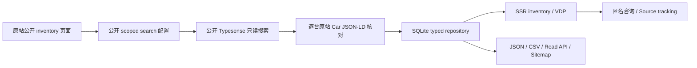

独立站公网地址：[Warren Vehicle Finder](https://warren-vehicle-finder.onrender.com)。

[一键创建免费 Render 部署](https://render.com/deploy?repo=https://github.com/gavingao202608-warren/warren1) · 先创建 Neon Free 并准备私密 DATABASE_URL，详见 [部署步骤](reports/DEPLOY_FREE.md)。

独立公网部署见 [免费部署说明](reports/DEPLOY_FREE.md)。客户存储支持 PostgreSQL；原官网只读，咨询归独立站运营者。

# Warren Vehicle Finder · Independent Discovery Gateway

独立的公开库存数据层，面向 Google、Bing、ChatGPT Search 和能够读取公开网页的系统。项目不修改现有 ZopDealer 网站，不使用广告、付费 API、第三方平台上传或获客保证。

第一版已导入原站公开搜索接口返回的 **全部 21 台在售车辆**，逐台以原站 Car JSON-LD 核对价格、公里数和 VIN。完整真实数据及原始观察时间见 `data/inventory.snapshot.json`。原站信息随时间变化；这是一次实际验证，不是永久库存保证。

## 架构

Next.js 16.4.0 stable、React 19、TypeScript、App Router、Tailwind CSS 4、Node.js 24 内置 SQLite。服务器直接生成车辆 HTML，只有咨询提交和匿名来源记录使用少量客户端 JavaScript。



`lib/db.ts` 是参数化 SQL 的轻量 typed repository；未引入 ORM 服务或数据库服务器。车辆事实存为 typed JSON，查询、咨询、同步日志及访问记录使用独立表。迁移 PostgreSQL 时替换 repository 和相应管理聚合查询，保持 Vehicle / feed / sync adapter 的契约。SQLite schema 在 `data/schema.sql`，TypeScript 数据模型在 `lib/model.ts`。

## 安装与一条命令启动

需要 Node.js **24.x**（`.nvmrc`），npm 和可写的本地磁盘。

```bash
cd /workspace/warren1
npm ci --cache /workspace/.npm-cache
npm run dev
```

启动命令自动初始化 SQLite，空库从真实库存快照恢复，保持原来的 `last_seen_at` / `updated_at`。快照超过 72 小时，恢复记录先标记 missing，不广告为当前在售。若没有设置管理员密码、也没有 `.env.local`，初始化会生成一个随机密码，写入权限 0600 的忽略文件 `.env.local`，**不打印密码**。在本地编辑器私下读取该文件，访问 `/admin` 登录；不要提交或分享文件。

已有依赖和生产构建时：

```bash
npm start
```

本次云环境已经安装、构建并启动生产服务器，端口 3000。实时进程不会自动进入未来任务的环境快照，需要按保存的 startup instructions 重启。源代码目前保留在工作目录；本任务没有向 GitHub 推送。

## 环境变量

复制 `.env.example` 到自己的忽略配置文件，或由部署平台注入。CLI 和 Next.js 都使用 Next 官方环境加载方式。

| 名称 | 默认 / 用途 |
| --- | --- |
| `PUBLIC_BASE_URL` | 本地默认 `http://localhost:3000`；公开部署必须改为实际 HTTPS 域名，控制 canonical / sitemap / Feed URL |
| `DATABASE_PATH` | `./data/inventory.sqlite`；生产必须在持久化磁盘，父目录可写 |
| `ADMIN_PASSWORD` | 管理员密码；未配置时管理员入口关闭，初始化可生成本地随机密码 |
| `SOURCE_BASE_URL` | `https://ultimatemotor.ca`；仅允许已授权的原站 HTTPS 域名 |
| `TEST_BASE_URL` | 集成/验收脚本访问的服务器地址，本地默认端口 3000 |
| `DISABLE_SNAPSHOT_WRITE` | 非空时同步不写可复用 public snapshot；数据库仍正常更新 |

不需要 OpenAI、Google、Meta、AutoTrader token。公开搜索接口的 search-only key 从原站浏览器配置读取，在内存中使用；不会硬编码、存入快照或日志，不改变其内置过滤范围。

## 同步库存

```bash
npm run sync-inventory
```

流程：读取 robots → 原站 inventory 中自然暴露的 public search 配置 → 分页、核对结果总数和唯一性 → 逐台读取原站 VDP JSON-LD → 事务更新 SQLite → 保存公开库存快照。请求间隔至少 1.5 秒，尊重 Crawl-delay；不并发轰炸、不绕过登录或反机器人、不关闭 TLS 验证。只读 key 的 scoped 过滤条件保留原样，只读取原站已经公开、visible、未删除、Instock 的库存。

- 新车添加；价格/公里数等事实变化更新；每次看见更新 `last_seen_at`。
- 完整分页成功时缺席的记录标记 missing；连续三次完整同步缺席才 unavailable。
- 能从旧详情页明确确认 sold 时标记 sold。
- 通用 sitemap / HTML adapter 只在没有公开 search 配置时使用；只有完整发现和明确 404/410 证据才做 missing 转换。
- 网络失败、空库存、分页变化、重复 stock、字段不一致、robots 无法验证时保留上次有效库存，记录失败；不会全部误标 sold。
- 每个成功、失败或取消运行都可在 admin 的 last sync 或 SQLite `sync_runs` 查看。
- 进程间原子文件锁阻止 admin 与 CLI 重叠同步。异常中断遗留锁一小时后回收；只有确认没有同步进程时才人工清理锁。
- 隐藏 price、VIN 以及未知字段保持 nullable；不把英里当作公里。不抓取或推断事故结论。CARFAX 只给出原站公开链接。

访问原站需要允许：`ultimatemotor.ca`、`www.ultimatemotor.ca`、`v6eba1srpfohj89dp-1.a1.typesense.net`。图片直接引用原站公开的 `zopsoftware-asset.b-cdn.net`。`zopsoftware.com` 用于原站公开前端脚本诊断，`ultimatemotor.zopsoftware.com` 为原站发布的 client destination。云环境已保存这些域名的配置草稿；草稿保存不等于发布。

## 页面、Feed 和 API

| 路径 | 行为 |
| --- | --- |
| `/` | Find a Used Vehicle、真实库存、自然语言搜索 |
| `/inventory?q=...` | 服务端渲染全部在售库存 / 条件过滤 / 明确标记 closest matches |
| `/v/[stock]` | 稳定 stock URL、价格、公里数、VIN、规格、图片、原始来源、观察/更新时间 |
| `/ask?vehicle=STOCK&source=chatgpt` | 无注册匿名提问，可选联系方式/同意 |
| `/admin` | 密码登录、库存统计、last sync、咨询、来源、热门浏览/提问、同步按钮 |
| `/feed/inventory.json` | version 1.0、dealer、生成时间、全部 available Vehicle 及 vehicle_url |
| `/feed/inventory.csv` | escaped CSV，包含要求的全部字段，防 spreadsheet formula injection |
| `/api/vehicles` | 全部 available records；`?q=` 返回 filters / exact / results |
| `/api/vehicles/[stock]` | 公开只读单车详情，库存不存在返回 404 |
| `/api/inquiries` | POST JSON 保存匿名问题，返回 inquiry_id；无 AI 编造回答 |
| `/api/track` | POST 记录匿名来源和落地路径；不保存 IP / 完整 referrer |
| `/sitemap.xml`、`/robots.txt` | 自动车辆发现、合法搜索 crawler 指令 |

车辆 URL 使用 stock 派生的稳定 id；无 stock 时用原站 inventory id。stock 改变会视为新身份；若业务需要复用 stock 或更复杂 VIN 去重，需要加稳定 identity migration，不能悄悄把两台车合并。

搜索识别年份、`2022+`、make / model / trim、预算、最大公里数、AWD/FWD/RWD/4WD 和车身词。支持需求中的四个验收 query 及 `2022 RAV4 XLE AWD under 35000 and under 80000 km`。零 exact match 显示 **No exact match found**，然后显示带解释的真实库存候选；这是规则匹配，不是付费 AI。

## 数据结构

`Vehicle`：id、stock_number、vin、year、make、model、trim、price_cad、mileage_km、body_style、drivetrain、transmission、engine、fuel_type、exterior_color、interior_color、accident_status、carfax_url、description、primary_image、image_urls、source_vehicle_url、availability、dealer_name、region、last_seen_at、updated_at。`availability` 额外支持 unknown，不把未提供状态猜为在售。

`inquiries`：inquiry_id、session_id、vehicle_id、source、question、created_at、contact_method、contact_value、consent。匿名咨询允许不留联系方式；有 contact_value 必须明确 consent。新增 is_test 与 lead_status，客户数据可用 DATABASE_URL 存储在独立 PostgreSQL；公网部署不会自动发送咨询给源车商。

`visits`：session_id、first_source、current_source、landing_page、vehicle_id、timestamp、限定 UTM campaign 字段。支持 google、bing、chatgpt、copilot、muse、facebook、instagram、xiaohongshu、autotrader、direct、unknown。匿名 HTTP-only session cookie 30 天。JavaScript tracking 不记录没有执行 JS 的 crawler 浏览量。

## SEO / crawler design

库存和 VDP 是动态 server-rendered HTML；核心事实在首个 HTTP 响应中，页面 JSON-LD 为 Car + Product 和存在真实价格时的 Offer。字段缺失不填 Schema；missing/unknown 不宣称 InStock。车辆有独立 title、description、canonical、Open Graph、Twitter metadata。

Sitemap 按数据库动态生成，仅列出 available 车辆；robots 明确允许 Googlebot、Bingbot、OAI-SearchBot，阻止 admin、写接口和咨询页面被索引。公开 API / Feed 有 60 秒缓存和基础限流。管理页 no-store/noindex，cookie HMAC 签名、8 小时有效，登录限流和同源检查。JSON 请求限制 10 KB；不接受跨域写入。

这是单进程 MVP 的内存限流；生产 reverse proxy 必须覆盖、不信任客户端的 `X-Forwarded-For` / `X-Forwarded-Proto`，并补充共享限流、监控、备份和数据保留策略。页面 `/privacy` 说明匿名记录和可选联系信息用途。

## 测试

```bash
npm test
npm run check
npm run build
# 先在另一个终端运行 npm start
npm run acceptance
npm run test:integration
```

unit tests 在临时 SQLite 上使用明确的 **SYNTHETIC TEST FIXTURE**，不会向产品数据库注入虚构车辆。验收及 HTTP integration 使用实际导入车辆，保存 `reports/acceptance.json` 和 `reports/integration.json`，覆盖 A–F、所有 VDP initial HTML/JSON-LD、Feed/API/sitemap、匿名咨询保存、来源保持、鉴权、跨域保护和登录限流。集成测试会创建带 Integration validation 标识的匿名咨询/访问记录；验收会保存要求的事故历史问题。这些是测试咨询，不是客户 lead。

查看当前真实库存审计表 `reports/source-inventory.md`。最终验证结果和失败尝试见 `DD_REPORT.md`。多次短时间重复 security 测试可能命中一分钟限流；在新服务器进程上运行或等窗口自然结束，不能把限流关掉。

## 部署与计划任务

推荐带持久磁盘的 Node.js 24 VM / 容器 + HTTPS reverse proxy；不要把 SQLite 放进短生命周期 serverless 函数。

```bash
npm ci
npm run init
npm run build
npm start
```

设置真实 `PUBLIC_BASE_URL`，保护 `.env.local` 和数据库，定时备份 SQLite。建议每天同步，cron 在项目目录执行 `npm run sync-inventory`；不要把 admin 密码作为 URL query 传递。可由 systemd / cron / GitHub Actions 调度 CLI，但 GitHub Actions 不能直接更新另一台服务器的本地 SQLite，需共享部署/同步机制。兼容 Vercel Cron 的扩展方向是迁移 PostgreSQL + 独立 cron token adapter，当前没有假称已部署这一集成。

公开部署后，可免费向 Google Search Console / Bing Webmaster Tools 提交 sitemap。需要实际域名和所有权验证；本次没有注册域名、对外部署、提交搜索平台或发送任何通知。

## 后续集成

CRM：在 inquiry repository 后追加 outbox / adapter，用明确的 consent 将有联系方式的咨询发送到已授权 CRM；匿名咨询保持匿名，重试需要幂等键，不把 HTTP 保存等同通知成功。

OpenAI：保持 API key 可选，读取当前 Vehicle，只回答已知事实，未知事故/finance/价格谈判明确不知道；接口需要速率/预算控制。Google/Meta/AutoTrader/OpenAI product adapters 可以以公开 read-only Feed 为边界独立实现，需先确认各渠道的产品规则、合规、价格和审批。

## 当前不能保证的事情

- **Public crawlability 不保证 Google / ChatGPT / Bing 一定展示车辆。**
- **OpenAI product feed 等 deeper integrations 可能需要 partner approval。**
- **Google Vehicle Ads 属于后续付费渠道。**
- **当前 MVP 验证 discoverability readiness，而不是保证 leads。**
- 本地可访问不是公开索引；部署、域名、提交与外部平台展现没有自动完成。
- 原站 search 配置、字段或 key 可能变化；严格验证会暂停同步并保留旧库存，而不是猜测。
- 事故历史未独立核验；CARFAX 链接存在不等于没有事故。
- 咨询仅入库、admin 可见，没有 email/SMS 通知，没有真实客户转化证明。

开源复用和许可证见 [THIRD_PARTY.md](THIRD_PARTY.md)，筛选记录见 [OPEN_SOURCE_RESEARCH.md](reports/OPEN_SOURCE_RESEARCH.md)。搜索 URL 自动提交遵循 IndexNow，只发送独立站公开 URL，不发送客户咨询；HTTP 接收成功不保证收录。
